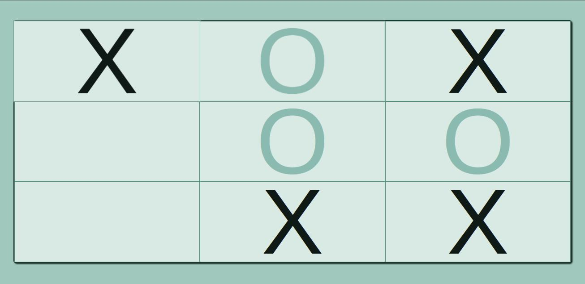

# Tic Tac Toe

- Print do app

## Descrição

(w.i.p.)Esse é um pequeno projeto que estou desenvolvendo apenas com HTML, CSS e vanilla JavaScript. A ideia é fazer um simples jogo da velha para dois jogadores (localmente) para treinar um pouco do meu conhecimento nessas linguagens. Foi tudo feito do zero por mim, então o código pode estar meio feio, mas está funcionando :). Ainda irei adicionar algumas features e deixar o app mais bonito, mas toda a lógica por trás já está funcionando. Espero que gostem!

### Como jogar:

O jogo inicia sempre no turno do jogador que escolheu o **X** para jogar. Assim que o primeiro jogador joga, automaticamente vira o turno do próximo jogador *(que utilizará o marcador **O**).*. Daí pra frente é só um jogo da velha comum, aproveitem!